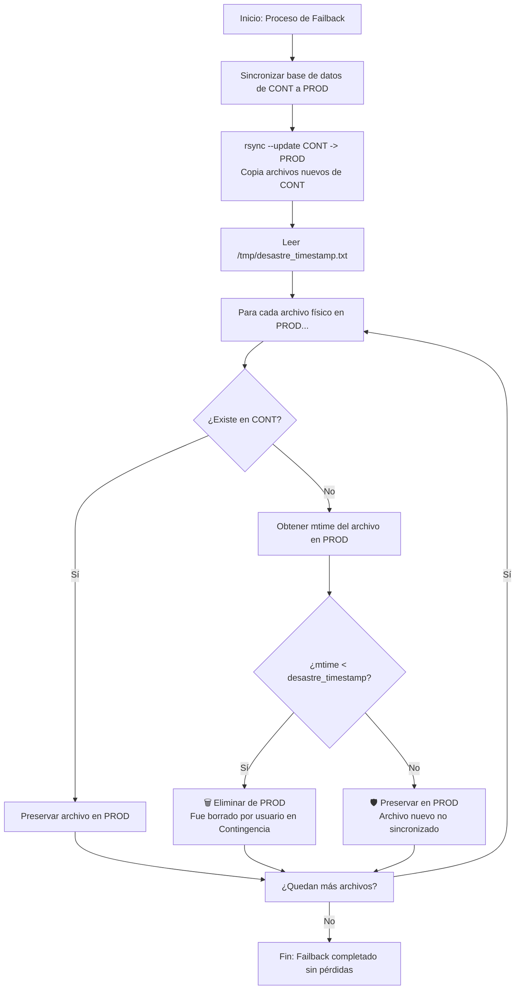

# Módulo: Respaldos y Backups (Infraestructura Cloud)

Este documento detalla la estrategia técnica de respaldos, la matriz de decisión de reconciliación y los diagramas de flujo de datos del servidor de Producción (`PROD`) y Contingencia (`CONT`) del proyecto Capacitaciones-M.

---

## 🗺️ Diagrama de Decisión de Reconciliación (Failback)

El siguiente diagrama ilustra cómo el algoritmo evalúa los archivos huérfanos durante el proceso de retorno para decidir de forma automática si un archivo fue eliminado a propósito por un usuario o si se trata de un archivo nuevo que no alcanzó a ser replicado.

---

## 📊 Matriz de Casos de Sincronización y Reconciliación

| ID | Estado en PROD (Pre-caída) | Sincronización Periódica (PROD -> CONT) | Acción en CONT (Durante Caída) | Estado en CONT (Pre-Failback) | Acción del Algoritmo en Failback (Reconciliación) | Estado Final en PROD (Post-Failback) | Riesgo / Observaciones |
|:---|:---|:---|:---|:---|:---|:---|:---|
| **C1** | `A.pdf` (`mtime < t_desastre`) | **ÉXITO** | Ninguna | `A.pdf` | No hace nada (ya existe y coincide). | `A.pdf` | **NINGUNO (Operación Normal)**. |
| **C2** | `A.pdf` (`mtime < t_desastre`) | **ÉXITO** | **Eliminado** por el usuario. | No existe | Detecta que no existe en CONT y que el archivo en PROD es viejo (`mtime < t_desastre`). **Borra `A.pdf` en PROD**. | No existe | **NINGUNO**. Sincroniza correctamente la eliminación hecha en Contingencia. |
| **C3** | `A.pdf` (`mtime < t_desastre`) | **FALLA** (No se sincronizó a CONT) | N/A | No existe | El archivo en PROD tiene `mtime < t_desastre`. Al no estar en CONT, el script lo interpreta como "borrado" en contingencia. **Borra `A.pdf` en PROD**. | No existe | **RIESGO BAJO**. Si el canal de sincronización periódica estuvo roto por semanas, archivos antiguos que no llegaron a CONT podrían ser borrados en PROD. *Solución: El cron reportará fallos de sincronización de inmediato.* |
| **C4** | No existe | N/A | **Creado** (`mtime > t_desastre`) | `B.pdf` | Copia `B.pdf` a PROD (`rsync --update`). | `B.pdf` | **NINGUNO**. Copia el archivo nuevo creado en Contingencia. |
| **C5** | `D.pdf` (`mtime > t_desastre` - Creado justo antes de caer) | **FALLA** (No se replicó) | Ninguna | No existe | El archivo en PROD tiene `mtime > t_desastre` (o sea, es nuevo de PROD). Al no estar en CONT, el script lo **Preserva en PROD**. | `D.pdf` | **NINGUNO (Resuelto)**. El algoritmo protege a `D.pdf` a pesar del fallo de réplica previo. |
| **C6** | `D.pdf` (`mtime > t_desastre` - Creado justo antes de caer) | **FALLA** (No se replicó) | **Creado** con el mismo nombre `D.pdf` en CONT | `D.pdf` (diferente contenido) | Si el archivo en CONT es más nuevo, se sobrescribe en PROD (`rsync --update`). Si no, se mantiene el de PROD. | `D.pdf` (versión de CONT) | **RIESGO MEDIO**. Colisión de nombres en archivos creados simultáneamente. Es un caso raro en producción (1 en un millón). |
| **C7** | `A.pdf` (`mtime < t_desastre`) | **ÉXITO** | **Modificado** (`mtime > t_desastre`) | `A.pdf` (nuevo) | Sobrescribe `A.pdf` en PROD por ser el de CONT el más nuevo (`rsync --update`). | `A.pdf` (versión de CONT) | **NINGUNO**. Actualiza el archivo modificado en Contingencia. |

---

## 🛡️ Mitigaciones Técnicas

Para evitar el caso **C3** (borrado accidental por fallas prolongadas de sincronización periódica):
1. **Monitoreo Activo:** El cron job que ejecuta la sincronización periódica reportará fallas de red de manera inmediata enviando una alerta (Slack, webhook, etc.).
2. **Respaldo antes de Reconciliación:** El script `failover-contingencia.sh` genera un volcado previo de los datos antes de aplicar cualquier acción de escritura, asegurando una red de seguridad física del host.
